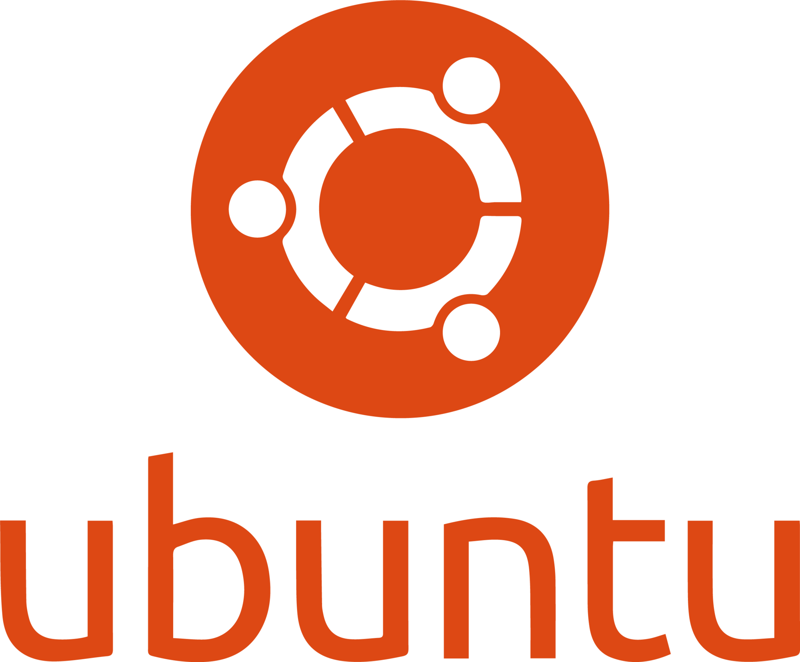

This repository consists of everything about `Ubuntu` a `Linux` distribution.

---

### Ubuntu-Linux Course Syllabus
#### Course Overview

**Course Title:** Ubuntu Linux Fundamentals
**Duration:** 6–8 Weeks (36–48 hours total)
**Target Audience:**
* Beginners to Linux
* Students in IT / Computer Science
* Developers and system administrators

**Prerequisites**
* Basic computer knowledge
* Familiarity with operating systems (e.g., Microsoft Windows or macOS)

**Learning Outcomes**
By the end of the course students will be able to:

* Install and configure Ubuntu
* Use the Linux command line efficiently
* Manage files, users, and permissions
* Install and manage software
* Perform basic system administration
* Configure networking and services
---
### 🎯 Quick Navigation

| Sl_No | Topics | Link |
| ----- | ------ | ---- |
| 1.    | **Module 1 :** Introduction to Linux & Ubuntu | |
|       | 1.1 What is Linux? | |
|       | 1.2 History of Linux | |
|       | 1.3 Linux distributions overview | |
|       | 1.4 Introduction to Ubuntu | |
|       | 1.5 Ubuntu versions and LTS releases | |
|       | 1.6 Desktop vs Server editions | |
| 2.    | **Module 2 :** Installing Ubuntu | |
|       | 2.1 Hardware requirements | |
|       | 2.2 Downloading Ubuntu ISO | |
|       | 2.3 Creating bootable USB | |
|       | 2.4 Installation methods | |
|       | 2.5.1 Full install | |
|       | 2.5.2 Dual boot | |
|       | 2.5.3 Virtual machine | |
| 3.    | **Module 3 :** Linux File System  | |
|       | 3.1 Linux directory structure
|       | 3.2 Root vs home directory | |
|       | 3.3 Key directories | |
|       | 3.3.1 /home | |
|       | 3.3.2 /etc | |
|       | 3.3.3 /var | |
|       | 3.3.4 /usr | |
|       | 3.3.5 /bin | |
| 4.    | **Module 4 :**  Ubuntu Desktop Basics | |
|       | 4.1 GNOME interface | |
|       | 4.2 File manager | |
|       | 4.3 Settings | |
|       | 4.4 Software center | |
| 5.    | **Module 5 :** Basic Linux Commands | |
|       | 5.1 Navigation | |
|       | 5.2 File operations | |
|       | 5.3 Viewing files | |
|       | 5.4 Searching files | |
| 6.    | **Module 6 :** Users, Groups & Permissions | |
|       | 6.1 Linux user accounts | |
|       | 6.2 Groups | |
|       | 6.3 File permissions | |
|       | 6.4 Ownership | |
| 7.    | **Module 7 :** Software Management | |
|       | 7.1 Package management
|       | 7.2 Software repositories
|       | 7.3 Installing and removing software
| 8.    | **Module 8 :** Networking Basics | |
|       | 8.1 Network configuration | |
|       | 8.2 Checking connectivity | |
|       | 8.3 IP addresses | |
| 9.    | **Module 9 :** Process & System Management | |
|       | 9.1 System processes | |
|       | 9.2 Monitoring system performance | |
|       | 8.3 Killing processes | |
| 10.    | **Module 10 :** Shell & Bash Scripting |  |
