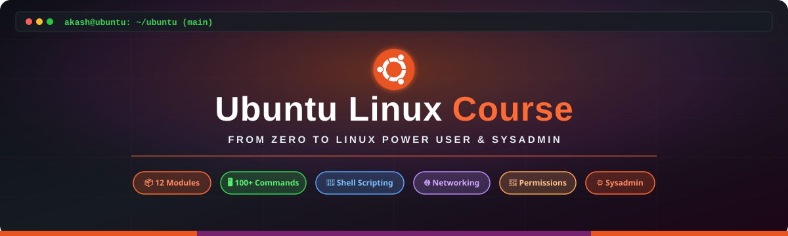

<div align="center">



# 🐧 Ubuntu Linux — Complete Learning Guide
### *From Beginner to Advanced Power User*

[](https://ubuntu.com)
[](#-course-syllabus)
[](./commands.md)
[](./LICENSE)

---

### 💡 Welcome to the Ultimate Ubuntu Linux Course!
Whether you are a **complete beginner** installing Linux for the first time, a **student**, a **developer**, or an aspiring **System Administrator / DevOps Engineer**, this structured course will take you step-by-step from foundational concepts to advanced command-line mastery and shell scripting.

</div>

---

## 🎯 Course Overview

- 📦 **12 Comprehensive Modules** covering theoretical principles, practical CLI usage, and real-world sysadmin workflows.
- 💻 **100+ Essential Commands** with detailed working principles, syntax breakdowns, and flags.
- 🐚 **Shells & Scripting Deep Dive** (Bash, Zsh, Fish) with production-ready code templates.
- ⚙️ **Hands-on System Administration** — Process management, systemd services, networking, firewall, LVM, and Docker.

---

## 📚 Complete Course Curriculum

| Module | Topic | Key Skills & Concepts Covered | Link |
| :---: | :--- | :--- | :---: |
| **01** | **Introduction to Linux & Ubuntu** | OS Architecture, Linux Kernel vs Distros, Ubuntu Versions & LTS, Desktop vs Server | [📖 Start Module](./modules/01-introduction.md) |
| **02** | **Installation Guide** | ISO Download, Bootable USB (Etcher/`dd`), Dual-Boot, VirtualBox VM, WSL2 Setup | [📖 Start Module](./modules/02-installation.md) |
| **03** | **Linux File System (FHS)** | "Everything is a file", FHS Directory Tree (`/etc`, `/var`, `/proc`), Absolute vs Relative Paths | [📖 Start Module](./modules/03-filesystem.md) |
| **04** | **Navigation & File Management** | `pwd`, `cd`, `ls`, `mkdir`, `cp`, `mv`, `rm`, `tar`, `zip`, Symlinks, Wildcards & Globbing | [📖 Start Module](./modules/04-navigation-files.md) |
| **05** | **Text Processing & Search** | `cat`, `less`, `head`, `tail -f`, `find`, `grep`, `sed`, `awk`, Redirection `>` & Pipes `\|` | [📖 Start Module](./modules/05-text-search.md) |
| **06** | **Users, Groups & Permissions** | `useradd`, `usermod`, `chmod` (rwx/octal), `chown`, SUID/SGID/Sticky Bit, `sudoers`, ACLs | [📖 Start Module](./modules/06-users-permissions.md) |
| **07** | **Software Management** | Package Repositories, `apt`, `dpkg`, `snap`, `flatpak`, `AppImage`, Compiling from Source | [📖 Start Module](./modules/07-software-management.md) |
| **08** | **Networking Commands** | `ip`, `ping`, `traceroute`, `dig`, `ss`, `nmap`, `wget`, `curl`, `ssh`, `scp`, `rsync`, UFW Firewall | [📖 Start Module](./modules/08-networking.md) |
| **09** | **Process & System Management** | `ps`, `top`/`htop`, `kill`, Background/Foreground (`bg`/`fg`), `systemctl`, `journalctl`, `cron` | [📖 Start Module](./modules/09-process-system.md) |
| **10** | **Shells in Ubuntu** | Bash, Zsh (Oh My Zsh), Fish, Config (`.bashrc`), Environment Variables, Aliases, Functions | [📖 Start Module](./modules/10-shells.md) |
| **11** | **Shell Scripting (Bash)** | Variables, User Input, Conditionals, Loops, Arrays, String Ops, Exit Codes, Trap & Functions | [📖 Start Module](./modules/11-shell-scripting.md) |
| **12** | **Advanced Sysadmin & Security** | Kernel Tuning (`sysctl`), Performance, LVM, Disk Quotas, Docker, iptables, Security Hardening | [📖 Start Module](./modules/12-advanced.md) |

---

## ⚡ Quick Reference Guide

- 📄 **[Master Commands Cheat Sheet](./commands.md)** — Comprehensive command reference grouped by domain

---

## 🚀 How to Use This Repository

1. **Clone the Repository:**
   ```bash
   git clone https://github.com/akashs278/ubuntu.git
   cd ubuntu
   ```

2. **Follow the Curriculum:**
   Start with **[Module 01](./modules/01-introduction.md)** and move sequentially through each module.

3. **Practice Commands:**
   Open an Ubuntu terminal (or WSL2 / VirtualBox) and execute the commands provided in each section to build muscle memory and understand working principles.

---

## 🤝 Contributing

Contributions are welcome! If you find any typos, want to add more command examples, or suggest new modules:
1. Fork the repository
2. Create your feature branch (`git checkout -b feature/AmazingFeature`)
3. Commit your changes (`git commit -m 'Add some AmazingFeature'`)
4. Push to the branch (`git push origin feature/AmazingFeature`)
5. Open a Pull Request

---

## 📄 License

This repository is licensed under the [MIT License](./LICENSE). Feel free to use, share, and adapt for your own learning or teaching!
