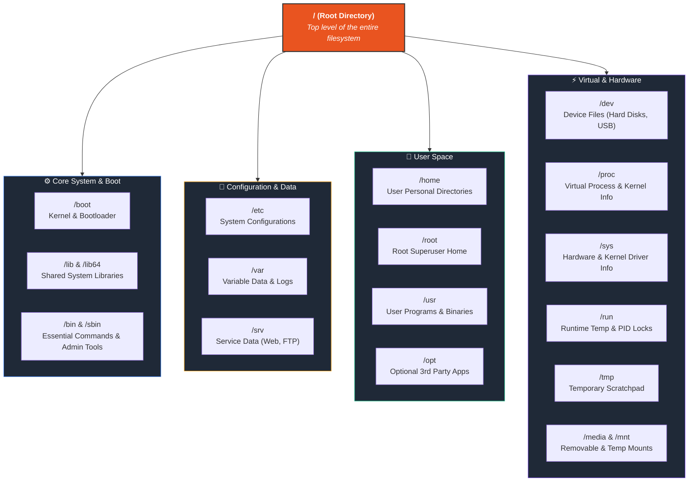

# Module 03 — Linux File System

> **🏠 [← Back to Main Course](../README.md)** | **[← Module 02](./02-installation.md)** | **[Module 04 →](./04-navigation-files.md)**

---

## 📋 Table of Contents

- [3.1 Everything is a File](#31-everything-is-a-file)
- [3.2 Linux Directory Structure (FHS)](#32-linux-directory-structure-fhs)
- [3.3 Key Directories Explained](#33-key-directories-explained)
- [3.4 Root vs Home Directory](#34-root-vs-home-directory)
- [3.5 File Types in Linux](#35-file-types-in-linux)
- [3.6 File Paths: Absolute vs Relative](#36-file-paths-absolute-vs-relative)
- [3.7 Hidden Files & Directories](#37-hidden-files--directories)
- [3.8 File System Commands](#38-file-system-commands)
- [3.9 Mounting & Unmounting](#39-mounting--unmounting)

---

## 3.1 Everything is a File

One of Linux's core philosophies is:

> **"Everything is a file"**

| Item | In Linux |
|------|----------|
| Text document | File |
| Directory/Folder | Special file |
| USB drive | File (`/dev/sdb`) |
| Your keyboard | File (`/dev/input/...`) |
| Network socket | File |
| Printer | File (`/dev/lp0`) |

This makes Linux powerful — you can interact with almost anything using file operations.

---

## 3.2 Linux Directory Structure (FHS)

The **Filesystem Hierarchy Standard (FHS)** defines the standard directory layout in Linux. Unlike Windows which uses separate drive letters (`C:\`, `D:\`), Linux organizes everything into a single inverted tree starting from the **Root Directory (`/`)**.

### 📌 1. High-Level Visual Architecture



---

### 🧠 2. Memorization Cheat Map (Grouped by Function)

To easily remember the Linux directory structure, keep these **5 Functional Groups** in mind:

| Group | Directory | Memory Mnemonic / Hook | What Lives Here? |
| :--- | :--- | :--- | :--- |
| **🚀 Boot & Core** | `/boot` | **Bootloader** | Linux Kernel (`vmlinuz`), Grub bootloader |
| | `/bin` & `/sbin` | **Binaries** & **System Binaries** | Essential commands (`ls`, `bash`) & Sysadmin tools (`fdisk`, `iptables`) |
| | `/lib` | **Libraries** | Shared code libraries required by binaries |
| **⚙️ Config & State** | `/etc` | **Editable Text Configuration** | All system configuration files (`/etc/passwd`, `/etc/nginx/`) |
| | `/var` | **Variable Data** | Dynamic data changing over time (Logs `/var/log`, databases, queues) |
| | `/srv` | **Services** | Site-specific data served by system (`/srv/www`, FTP data) |
| **👤 Users & Apps** | `/home` | **User Homes** | Personal user workspace (`/home/username`), desktop, documents |
| | `/root` | **Root Home** | Home directory for the `root` superuser (distinct from `/`) |
| | `/usr` | **User System Resources** | Non-essential user binaries (`/usr/bin`), shared assets (`/usr/share`) |
| | `/opt` | **Optional Software** | Third-party standalone software packages (e.g., Chrome, Discord) |
| **🔌 Devices & Mounts** | `/dev` | **Devices** | Hardware node representations (`/dev/sda`, `/dev/null`, `/dev/tty`) |
| | `/media` | **Removable Media** | Auto-mounted USB drives, optical discs (`/media/user/USB`) |
| | `/mnt` | **Manual Mounts** | Temporary manual filesystem mount points |
| **⚡ Virtual & Temp** | `/proc` | **Processes Info** | Virtual RAM-based filesystem: running process IDs, CPU/memory status |
| | `/sys` | **System Hardware** | Virtual RAM-based filesystem: active kernel device drivers and buses |
| | `/run` | **Runtime Info** | Volatile state since last boot (PID files, sockets, locks) |
| | `/tmp` | **Temporary Files** | Scratch space for apps (auto-cleaned on reboot) |

---

### 📂 3. Complete FHS Hierarchy Tree

```text
/ (Root Directory)
├── 📂 boot/            → Kernel image (vmlinuz), initramfs, Grub bootloader
├── 📂 etc/             → System-wide configuration files (passwd, hosts, network)
├── 📂 home/            → User home spaces
│   ├── 📂 akash/       → Personal user directory (~/)
│   └── 📂 john/        → Secondary user workspace
├── 📂 root/            → Superuser (root) home directory
├── 📂 bin -> usr/bin   → Essential user binary commands (ls, cp, bash)
├── 📂 sbin -> usr/sbin → Essential administrative commands (fdisk, ip, reboot)
├── 📂 lib -> usr/lib   → Shared core libraries needed by system binaries
├── 📂 usr/             → Secondary hierarchy for user utilities & read-only data
│   ├── 📂 bin/         → Non-essential application binaries (python3, git)
│   ├── 📂 lib/         → Application libraries
│   ├── 📂 local/       → Locally compiled/installed software (/usr/local/bin)
│   └── 📂 share/       → Architecture-independent shared assets (man pages, icons)
├── 📂 var/             → Variable data files (frequently modified at runtime)
│   ├── 📂 log/         → System and service log files (syslog, auth.log)
│   ├── 📂 www/         → Web server document root (Apache/Nginx)
│   └── 📂 spool/       → Queues for cron, print, mail tasks
├── 📂 dev/             → Hardware device node interfaces (sda, null, zero)
├── 📂 proc/            → Virtual process & kernel information (CPU, RAM, PIDs)
├── 📂 sys/             → Virtual kernel interface for hardware device drivers
├── 📂 run/             → Runtime process status (sockets, lock files, PIDs)
├── 📂 media/           → Automatic mount location for removable storage (USB, CD)
├── 📂 mnt/             → Manual temporary filesystem mount points
├── 📂 opt/             → Add-on third-party software packages (e.g. Google Chrome)
└── 📂 tmp/             → Temporary scratchpad (automatically wiped on boot)
```

---

## 3.3 Key Directories Explained

### `/` — Root Directory
```bash
ls /          # See all top-level directories
# Everything starts here. Not the same as /root!
```

### `/home` — User Home Directories
```bash
ls /home          # List all user home directories
echo $HOME        # Your home directory path
cd ~              # Go to your home directory
ls ~              # List your home directory

# Your home contains:
# /home/username/
#   ├── Desktop/
#   ├── Documents/
#   ├── Downloads/
#   ├── .bashrc       (hidden config file)
#   └── .ssh/         (hidden SSH keys)
```

### `/etc` — Configuration Files
```bash
ls /etc           # All system config files

# Important files:
cat /etc/hostname          # Your computer name
cat /etc/hosts             # Host-to-IP mappings
cat /etc/fstab             # Filesystem mount table
cat /etc/passwd            # User account info
cat /etc/shadow            # Encrypted passwords
cat /etc/group             # Group info
cat /etc/os-release        # OS version info
cat /etc/apt/sources.list  # APT repository list
ls /etc/network/           # Network configuration
```

### `/var` — Variable Data (Logs)
```bash
ls /var/log       # All system logs

# Important log files:
sudo tail -f /var/log/syslog          # System log (live)
sudo tail -f /var/log/auth.log        # Authentication log
sudo tail -f /var/log/kern.log        # Kernel log
sudo tail -f /var/log/dpkg.log        # Package install log
sudo tail -f /var/log/apache2/error.log  # Apache errors
```

### `/proc` — Process & Kernel Info (Virtual)
```bash
cat /proc/cpuinfo     # CPU details
cat /proc/meminfo     # Memory details
cat /proc/version     # Kernel version
cat /proc/uptime      # System uptime in seconds
ls /proc/$$           # Current shell's process info
```

### `/dev` — Device Files
```bash
ls /dev           # All device files

# Common devices:
# /dev/sda          → First SATA/SSD hard drive
# /dev/sda1         → First partition of sda
# /dev/sdb          → Second drive (often USB)
# /dev/null         → The "black hole" (discards everything)
# /dev/zero         → Generates infinite zeros
# /dev/random       → Random data generator
# /dev/tty          → Current terminal
# /dev/stdin        → Standard input

# Useful trick: discard output
some_command 2>/dev/null   # Discard error output
```

### `/tmp` — Temporary Files
```bash
ls /tmp           # Temporary files (cleared on reboot)

# Use /tmp for temporary work:
cp myfile.txt /tmp/
# Files here are auto-deleted when system restarts
```

### `/usr` — User Programs
```bash
ls /usr/bin       # Most installed programs live here
which python3     # Find where a program is installed
which bash        # → /usr/bin/bash
```

---

## 3.4 Root vs Home Directory

| | Root Directory `/` | Root User's Home `/root` | Your Home `~` |
|-|-------|------|------|
| **What is it?** | Top of filesystem | Home of `root` user | Your personal space |
| **Access** | Everyone (read) | Only root | Only you |
| **Contains** | All system directories | Root's files | Your files |
| **Path** | `/` | `/root` | `/home/username` |

```bash
# Confused about "root"?

cd /       # Go to root of filesystem (/)
cd /root   # Go to root USER's home (requires root access)
cd ~       # Go to YOUR home (/home/yourusername)
cd $HOME   # Same as above
```

---

## 3.5 File Types in Linux

Linux has 7 file types. You can see them with `ls -l`:

```bash
ls -l /dev | head -20
# First character shows the file type:
# d  → Directory
# -  → Regular file
# l  → Symbolic link (shortcut)
# c  → Character device (keyboard, terminal)
# b  → Block device (hard drive, USB)
# s  → Socket (network communication)
# p  → Named pipe (FIFO)
```

### Examples
```bash
# Check file type
file /etc/hosts       # → ASCII text
file /bin/bash        # → ELF 64-bit executable
file /dev/sda         # → block special
file /tmp             # → directory

# Using ls -l
ls -la ~
# drwxr-xr-x  → Directory (d)
# -rw-r--r--  → Regular file (-)
# lrwxrwxrwx  → Symbolic link (l)
```

---

## 3.6 File Paths: Absolute vs Relative

### Absolute Path
```bash
# Starts from root /
# Always correct regardless of where you are

cd /home/akash/Documents    # Absolute path
ls /etc/apt/sources.list    # Absolute path
cat /var/log/syslog         # Absolute path
```

### Relative Path
```bash
# Relative to your CURRENT location
# Changes meaning depending on where you are

cd Documents          # Relative to current dir
ls ../Downloads       # Go up one then into Downloads
cat ./myfile.txt      # Current directory
```

### Special Path Symbols
```bash
.          # Current directory
..         # Parent directory
~          # Your home directory (/home/username)
-          # Previous directory (cd -)
/          # Root directory
```

---

## 3.7 Hidden Files & Directories

In Linux, files starting with `.` (dot) are **hidden**:

```bash
ls ~              # Shows normal files
ls -a ~           # Shows hidden files too (starting with .)
ls -la ~          # Shows hidden files with details

# Common hidden files in your home:
# ~/.bashrc          → Bash configuration
# ~/.bash_profile    → Login shell config
# ~/.bash_history    → Command history
# ~/.ssh/            → SSH keys
# ~/.config/         → Application configs
# ~/.local/          → Local app data

# Create a hidden file
touch .myhiddenfile
ls -a | grep "^\."  # Show only hidden files
```

---

## 3.8 File System Commands

```bash
# ── Disk Space ───────────────────────────────────────
df -h                    # Disk free space (human-readable)
df -h /home              # Space on /home partition
df -T                    # Show filesystem types

# ── Directory Size ───────────────────────────────────
du -h /home/akash        # Size of directory
du -sh *                 # Size of each item in current dir
du -sh /* 2>/dev/null    # Size of each root directory
du -h --max-depth=1 /    # One level deep from root

# ── Filesystem Type ──────────────────────────────────
lsblk                    # List block devices (disks, partitions)
lsblk -f                 # Show filesystem types
blkid                    # Show UUIDs and filesystem types
sudo fdisk -l            # Full disk/partition list

# ── Find Largest Files ───────────────────────────────
du -ah /home | sort -rh | head -20    # Top 20 largest files

# ── Inode Usage ──────────────────────────────────────
df -i                    # Show inode usage (file count limits)

# ── Filesystem Check & Repair ────────────────────────
sudo fsck /dev/sda1      # Check filesystem (unmounted only)
sudo e2fsck -f /dev/sda1 # Force check ext4 filesystem
```

---

## 3.9 Mounting & Unmounting

```bash
# ── Mount a USB Drive ────────────────────────────────
lsblk                              # Find USB device name
sudo mkdir -p /mnt/usb             # Create mount point
sudo mount /dev/sdb1 /mnt/usb      # Mount USB
ls /mnt/usb                        # Access files

# ── Unmount ──────────────────────────────────────────
sudo umount /mnt/usb               # Unmount by path
sudo umount /dev/sdb1              # Unmount by device

# ── Auto-mount at Boot (edit /etc/fstab) ─────────────
cat /etc/fstab                     # View current auto-mounts
# Format: <device> <mountpoint> <fstype> <options> <dump> <pass>
# Example:
# UUID=xxxx-xxxx  /mnt/data  ext4  defaults  0  2

# ── Mount ISO File ───────────────────────────────────
sudo mkdir /mnt/iso
sudo mount -o loop ubuntu.iso /mnt/iso
ls /mnt/iso

# ── Temporary RAM Disk (tmpfs) ───────────────────────
sudo mount -t tmpfs -o size=512m tmpfs /mnt/ramdisk
```

---

## ✅ Module 03 Summary

| Directory | Purpose |
|-----------|---------|
| `/` | Root of entire filesystem |
| `/home` | User home directories |
| `/etc` | System configuration |
| `/var/log` | System log files |
| `/proc` | Virtual: kernel & process info |
| `/dev` | Device files |
| `/tmp` | Temporary storage |
| `/usr/bin` | User programs |
| `/sbin` | System admin programs |

---

> **▶ Next Module: [Module 04 — Navigation & File Management Commands →](./04-navigation-files.md)**
